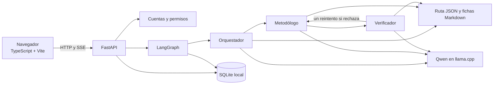

# Hilo · asistente metodológico Ruta DIA

Hilo es un prototipo de trabajo de grado para acompañar proyectos de innovación.
Combina una ruta metodológica con un asistente de tres roles, proyectos persistentes,
herramientas interactivas y colaboración entre cuentas de una misma instalación.
La aplicación está en [`prototipo/`](prototipo/); este README explica cómo instalarla,
cómo funciona y dónde está cada documento.

> **Estado:** prototipo local para Windows. La interfaz y el modelo escuchan en
> `127.0.0.1`. Publicar el código en GitHub no publica la aplicación ni permite
> que otros computadores entren a los proyectos guardados en esta máquina.

## Contenido

- [Funciones disponibles](#funciones-disponibles)
- [Requisitos](#requisitos)
- [Instalación desde cero](#instalación-desde-cero)
- [Iniciar y detener](#iniciar-y-detener)
- [Arquitectura](#arquitectura)
- [Datos y configuración](#datos-y-configuración)
- [Estructura del repositorio](#estructura-del-repositorio)
- [Documentación](#documentación)
- [Desarrollo y pruebas](#desarrollo-y-pruebas)
- [Problemas frecuentes](#problemas-frecuentes)

## Funciones disponibles

- **Asistente metodológico:** LangGraph coordina Orquestador, Metodólogo y
  Verificador. La ruta tiene 10 etapas y 15 fichas habilitadas. CrewAI permanece
  como línea base para comparación.
- **Cuentas y proyectos:** registro, inicio de sesión, carpetas de proyectos,
  contexto del reto, historial de chat, memoria persistente y Post-its.
- **Colaboración local:** invitaciones a otras cuentas de esta instalación,
  permisos de lectura o edición, avances comunes y chat privado por participante.
- **Árbol de problemas:** tablero de problema central, causas y efectos que se
  guarda por proyecto con control de versiones. Un origen escrito en el árbol no
  se convierte automáticamente en evidencia verificada.
- **Agenda:** calendario y tareas personales o vinculadas a proyectos, con fecha,
  prioridad y estado.
- **Seguimiento del agente:** la interfaz muestra el flujo, reintentos, dictamen
  y ficha metodológica utilizada.

Las fichas son material de trabajo del prototipo. La aprobación del Verificador
no equivale a validación experta. Todavía no hay RAG vectorial ni acceso remoto
entre computadores.

## Requisitos

| Componente | Requisito para esta configuración |
| --- | --- |
| Sistema | Windows x64 y PowerShell |
| Python | 3.10 a 3.13; [`.python-version`](prototipo/.python-version) fija 3.13 |
| Gestor Python | `uv`, instalado como módulo de Python |
| Frontend | Node.js y npm (probado con Node.js 24), y `pnpm` 11.15.1 (según [`package.json`](prototipo/frontend/package.json)) |
| Modelo local | El instalador incluido descarga Qwen3.5-4B y llama.cpp para Windows x64/CUDA 12.4; requiere hardware y controladores NVIDIA compatibles |
| Espacio | Aproximadamente 3,4 GB de descargas para modelo y runtime, más dependencias y datos |

El script incluido instala la compilación CUDA. No ofrece una instalación
alternativa de llama.cpp para CPU u otros sistemas operativos.

## Instalación desde cero

Abre **PowerShell**. Instala Python, Node.js y Git si aún no están disponibles;
comprueba sus comandos y luego instala los gestores del proyecto:

```powershell
python --version
node --version
git --version
python -m pip install --user uv
npm install --global pnpm@11.15.1
python -m uv --version
pnpm --version
```

Clona el repositorio y entra en la carpeta de la aplicación:

```powershell
git clone https://github.com/crparra4/sma-metodologias-innovacion.git
cd .\sma-metodologias-innovacion\prototipo
```

Instala el backend y el frontend. `uv` crea `.venv` dentro de `prototipo`; el
frontend usa el lockfile de pnpm:

```powershell
python -m uv --system-certs sync --extra dev --link-mode copy
pnpm --dir frontend install --frozen-lockfile
pnpm --dir frontend build
Copy-Item .env.example .env
```

Abre `.env` con un editor y **reemplaza** el valor de `RUTA_DIA_API_KEY` por una
clave privada elegida para esta instalación. El ejemplo ya selecciona LangGraph,
Qwen y `http://127.0.0.1:18083/v1`. No compartas `.env` ni lo subas a Git.
La clave se usa entre el backend y llama.cpp en tu computador.

Para descargar el modelo por separado, ejecuta:

```powershell
.\.venv\Scripts\python.exe scripts/install_local_model.py
```

La descarga se verifica con SHA-256 y puede reanudarse ejecutando de nuevo ese
comando. Los archivos quedan en `%LOCALAPPDATA%\QwenLocalTest`, fuera del
repositorio. También puedes omitir este paso: el script de inicio los descarga
cuando faltan.

## Iniciar y detener

Todos los comandos siguientes se ejecutan desde `prototipo`:

```powershell
# Inicia Qwen, la API y la interfaz; abre el navegador.
.\scripts\start_interface.ps1

# Comprueba la API local.
Invoke-RestMethod http://127.0.0.1:8787/api/status

# Detiene la interfaz y después el modelo.
.\scripts\stop_interface.ps1
.\.venv\Scripts\python.exe scripts/local_model.py stop
```

La aplicación se abre en **http://127.0.0.1:8787/**. En una instalación nueva,
registra la primera cuenta desde esa página. Las cuentas y proyectos de otro
computador no vienen en la descarga de GitHub. Usa `-NoBrowser` para iniciar sin
abrir el navegador. Para otro puerto de interfaz, usa `-Port 8788` al iniciar y
al detener.

El modelo puede administrarse de forma independiente:

```powershell
.\.venv\Scripts\python.exe scripts/local_model.py start
.\.venv\Scripts\python.exe scripts/local_model.py status
.\.venv\Scripts\python.exe scripts/local_model.py stop
```

### Ejecutar cada componente por separado

Para desarrollo puedes usar tres terminales PowerShell, todas situadas en
`prototipo`:

```powershell
# Terminal 1: inicia el modelo en segundo plano (puedes cerrar esta terminal).
.\.venv\Scripts\python.exe scripts/local_model.py start

# Terminal 2: deja la API y el frontend compilado en primer plano.
.\.venv\Scripts\ruta-dia.exe web --port 8787

# Terminal 3: inicia Vite con recarga automática del frontend.
pnpm --dir frontend dev
```

En este modo, abre `http://127.0.0.1:5173/` para trabajar con Vite o
`http://127.0.0.1:8787/` para ver la compilación servida por FastAPI. Detén los
procesos en primer plano con `Ctrl+C` y el modelo con `local_model.py stop`.

## Arquitectura



1. El navegador llama a FastAPI. El chat transmite eventos de ejecución por SSE;
   el backend también sirve el frontend compilado.
2. El Orquestador selecciona etapa y herramienta desde el índice de la ruta. El
   Metodólogo recibe una ficha. El Verificador evalúa su respuesta contra esa
   ficha y los datos aportados. Pydantic valida los contratos y hay controles
   deterministas antes de guardar resultados.
3. Si el Verificador rechaza, el grafo permite un reintento del Metodólogo. Un
   segundo rechazo produce una respuesta de degradación explícita. Si falta
   una ficha, el sistema comunica el vacío.
4. `DirectOpenAIRuntime` llama a llama.cpp en `127.0.0.1:18083`; el navegador
   no consulta directamente al modelo.
5. SQLite conserva cuentas, permisos, proyectos, chat, avances y checkpoints.
   El catálogo metodológico permanece en JSON y Markdown versionados.

La arquitectura detallada está en
[`arquitectura-langgraph.md`](prototipo/docs/arquitectura-langgraph.md).

## Datos y configuración

| Ubicación | Contenido |
| --- | --- |
| `prototipo/.env` | Configuración y clave local; ignorado por Git |
| `%LOCALAPPDATA%\QwenLocalTest` | GGUF, llama.cpp y archivos del proceso del modelo |
| `%LOCALAPPDATA%\RutaDIA\auth.sqlite3` | Cuentas, sesiones, invitaciones, miembros, avances y árboles compartidos |
| `%LOCALAPPDATA%\RutaDIA\notebooks.sqlite3` y `checkpoints.sqlite3` | Datos y checkpoints heredados de la primera cuenta |
| `%LOCALAPPDATA%\RutaDIA\users\<id>\` | Datos y checkpoints separados de otras cuentas |
| `prototipo/data/` | Auditorías y resultados de evaluación locales; ignorados por Git |

`RUTA_DIA_DATA_DIR` permite elegir otra carpeta de datos. Para respaldar la
instalación, detén la interfaz y copia **toda** la carpeta `%LOCALAPPDATA%\RutaDIA`:
incluye la base de cuentas y las carpetas de los usuarios. Copiar solo
`notebooks.sqlite3` no conserva por sí mismo cuentas ni proyectos compartidos.

Variables principales de [`.env.example`](prototipo/.env.example):

| Variable | Uso |
| --- | --- |
| `RUTA_DIA_RUNTIME` | `langgraph` para la interfaz local; `crewai` como línea base |
| `RUTA_DIA_MODEL` | Alias del modelo, `Qwen3.5-4B-Q4_K_M` en el ejemplo |
| `RUTA_DIA_BASE_URL` | Endpoint local `http://127.0.0.1:18083/v1` |
| `RUTA_DIA_API_KEY` | Clave privada para el servidor local del modelo |
| `RUTA_DIA_DATA_DIR` | Carpeta opcional para datos persistentes |

La interfaz está restringida a localhost. El código actual no incluye despliegue
remoto, HTTPS ni una base de datos compartida entre computadores.

## Estructura del repositorio

```text
prototipo/
├── frontend/                 # Interfaz Vite/TypeScript y recursos visuales
│   ├── src/main.ts           # Navegación y pantallas
│   └── src/problem-tree.ts   # Árbol de problemas interactivo
├── src/ruta_dia_agents/      # API, agentes, contratos, memoria y permisos
│   ├── web.py                # FastAPI y rutas HTTP
│   ├── langgraph_workflow.py # Flujo de los tres roles
│   ├── sharing.py            # Proyectos compartidos y avances
│   └── auth.py               # Cuentas y sesiones
├── knowledge/
│   ├── routes/ruta-dia.json  # Etapas y herramientas habilitadas
│   ├── tools/                # Fichas metodológicas
│   └── frameworks/           # Marcos teóricos de apoyo
├── scripts/                  # Instalación, arranque y evaluación local
├── tests/                    # Pruebas del backend
├── evaluation/               # Casos y protocolo del piloto
└── docs/                     # Arquitectura, interfaz y resultados
```

## Documentación

| Documento | Contenido |
| --- | --- |
| [`prototipo/README.md`](prototipo/README.md) | CLI, memoria y evaluación del núcleo multiagente |
| [`docs/interfaz-local.md`](prototipo/docs/interfaz-local.md) | Interfaz, cuentas, proyectos, Post-its, agenda y árbol |
| [`docs/arquitectura-langgraph.md`](prototipo/docs/arquitectura-langgraph.md) | Flujo LangGraph, responsabilidades y persistencia |
| [`docs/arquitectura.md`](prototipo/docs/arquitectura.md) | Decisión inicial con CrewAI; documento histórico |
| [`docs/plan-compartir-proyectos.md`](prototipo/docs/plan-compartir-proyectos.md) | Primera versión local y ampliaciones de colaboración pendientes |
| [`docs/configuracion-qwen3.5-4b-2026-09-09.md`](prototipo/docs/configuracion-qwen3.5-4b-2026-09-09.md) | Configuración de Qwen y batería técnica |
| [`docs/comparacion-local-qwen-2026-09-07.md`](prototipo/docs/comparacion-local-qwen-2026-09-07.md) | Comparación exploratoria de modelos |
| [`docs/prueba-qwen-local-2026-09-07.md`](prototipo/docs/prueba-qwen-local-2026-09-07.md) | Prueba exploratoria del modelo de 27B |
| [`evaluation/PROTOCOL.md`](prototipo/evaluation/PROTOCOL.md) y [`cases.json`](prototipo/evaluation/cases.json) | Protocolo y casos del piloto |
| [`knowledge/frameworks/README.md`](prototipo/knowledge/frameworks/README.md) | Marcos teóricos; fichas ejecutables en [`knowledge/tools/`](prototipo/knowledge/tools/) |

Los informes con fecha describen ejecuciones concretas; sus cifras de pruebas
no representan necesariamente el estado más reciente del repositorio.

## Desarrollo y pruebas

Desde `prototipo`, ejecuta las comprobaciones sin enviar mensajes al modelo:

```powershell
.\.venv\Scripts\ruta-dia.exe validate
.\.venv\Scripts\python.exe -m pytest -q
.\.venv\Scripts\python.exe -m ruff check .
pnpm --dir frontend build
node --test frontend/tests/agenda.test.mjs
```

Para desarrollar el frontend con recarga automática, deja el backend encendido
y ejecuta `pnpm --dir frontend dev`; Vite reenvía `/api` a `127.0.0.1:8787`.
Después de cambiar el frontend, recompílalo si lo abrirás desde FastAPI. Después
de cambiar Python, reinicia la interfaz.

La CLI permite un turno directo, conversación persistente y consulta de memoria;
los comandos están en [`prototipo/README.md`](prototipo/README.md). Las rutas de
la API se agrupan en `/api/auth`, `/api/notebooks`, `/api/projects`, `/api/tasks`
y `/api/chat`. `/api/status` permite comprobar interfaz y modelo.

## Problemas frecuentes

| Síntoma | Comprobación y acción |
| --- | --- |
| Faltan archivos de Qwen o llama.cpp | Desde `prototipo`, ejecuta `.\.venv\Scripts\python.exe scripts/install_local_model.py`; comprueba `%LOCALAPPDATA%\QwenLocalTest`. |
| Se pide `RUTA_DIA_API_KEY` | Copia `.env.example` a `.env` y reemplaza la clave de ejemplo. |
| `pnpm` no se reconoce | Instala Node.js; ejecuta `npm install --global pnpm@11.15.1` y abre una nueva terminal. |
| `python -m uv` no se reconoce | Ejecuta `python -m pip install --user uv` con el mismo Python que usarás para `sync`. |
| El puerto 8787 está ocupado | Usa `.\scripts\start_interface.ps1 -Port 8788` y entra a `http://127.0.0.1:8788/`. |
| Olvidaste la contraseña de una cuenta existente | Con la interfaz detenida, ejecuta `.\.venv\Scripts\python.exe scripts/reset_local_password.py NOMBRE_DE_USUARIO`. Pide una clave nueva y crea una copia de la base de cuentas. |

Los registros de la interfaz se guardan en `%LOCALAPPDATA%\RutaDIA` y el del
modelo en `%LOCALAPPDATA%\QwenLocalTest\ruta-dia-server.log`.
