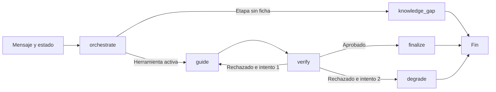

# Prototipo Ruta DIA con LangGraph

## Persistencia y memoria

La persistencia separa responsabilidades:

- `checkpoints.sqlite3` es propiedad de LangGraph y conserva el estado técnico de cada ejecución,
  identificado por `thread_id = notebook_id`.
- `notebooks.sqlite3` es propiedad de Ruta DIA y conserva etapa, herramienta activa, los últimos
  turnos y campos metodológicos verificados con su turno de origen. También conserva color y
  contexto inicial en columnas separadas, sin convertir hipótesis ni metas en resultados verificados.
- Las fichas Markdown y el índice JSON siguen siendo la fuente metodológica versionada. Una
  conversación nunca se incorpora automáticamente a esa base de conocimiento.

Ambas bases se crean en `%LOCALAPPDATA%\RutaDIA` para evitar ejecutar SQLite dentro de una carpeta
sincronizada por OneDrive. `RUTA_DIA_DATA_DIR` permite cambiar la ubicación. La memoria de contexto
conversacional que se entrega al modelo se limita a ocho intervenciones recientes, mientras el historial completo
permanece disponible en SQLite para auditoría.
El contexto inicial se entrega adicionalmente en `ProjectState.context`, con seis campos limitados
a 1500 caracteres cada uno. Se puede editar entre turnos; una generación activa bloquea su edición.

## Objetivo

Esta implementación reemplaza la ejecución de Crews por un grafo explícito, conservando Qwen local,
las 15 fichas metodológicas, los contratos Pydantic y los controles deterministas. CrewAI permanece
disponible como línea base para una comparación posterior.

## Flujo implementado



Los nodos y las condiciones están definidos en `src/ruta_dia_agents/langgraph_workflow.py`. El estado
del checkpoint se serializa como JSON, evitando depender de la reconstrucción de clases dinámicas.
Cada conversación usa `notebook_id` como identificador de hilo.

## Separación de responsabilidades

- **LangGraph:** decide el orden de ejecución, las bifurcaciones y el único reintento.
- **DirectOpenAIRuntime:** solicita contratos JSON Schema al endpoint local compatible con OpenAI.
- **Qwen3.5-4B:** clasifica la ruta, redacta la próxima pregunta y realiza la evaluación semántica.
- **Código determinista:** valida herramientas, encabezados, campos, evidencias cercanas, números,
  coherencia del veredicto y reglas conocidas de las fichas.
- **Pydantic:** valida todos los objetos intercambiados entre nodos.

El Orquestador y el Metodólogo tienen un máximo de 384 tokens y razonamiento extendido desactivado.
El Verificador puede usar hasta 1.536 tokens y un presupuesto de razonamiento de 1.024 tokens.

## Uso

Con el servidor local iniciado, un turno independiente se ejecuta con:

```powershell
.\.venv\Scripts\ruta-dia.exe chat --runtime langgraph `
  --message "Quiero aplicar cinco porqués. Guíame con una pregunta." --stage 1
```

Una conversación que recupera el estado incluso después de cerrar el proceso se inicia con:

```powershell
.\.venv\Scripts\ruta-dia.exe interactive --runtime langgraph `
  --stage 1 --notebook prueba-personal
```

El comando muestra la respuesta, el veredicto, la herramienta activa y el número de intentos. Se
termina escribiendo `/salir`.

## Verificación realizada

- **63 pruebas automatizadas aprobadas** y `ruff` sin hallazgos.
- El grafo contiene nodos separados para orquestar, guiar, verificar, finalizar y degradar.
- Se comprobó mediante pruebas que un rechazo vuelve al Metodólogo una vez y que un segundo rechazo
  produce la respuesta segura.
- Se ejecutó una conversación real de dos turnos: el segundo mensaje utilizó el problema y la causa
  aportados en el historial, conservó `cinco-porques` y fue aprobado.
- La batería completa final `20260909T165929Z-langgraph` obtuvo **8/8** controles mecánicos con la
  semilla 42. Los controles V01 y V02 también se repitieron con las semillas 42 y 43 después de la
  última corrección y obtuvieron **4/4**.

La evaluación encontró dos falsos rechazos del modelo pequeño antes de llegar al resultado final:
preguntar por qué después de un problema ya formulado y enunciar el problema concreto fueron
marcados incorrectamente como pasos prematuros o inventados. Ambos comportamientos ahora se
resuelven con reglas deterministas respaldadas por la ficha. Esta historia se conserva porque muestra
por qué el control del flujo por sí solo no elimina la variabilidad semántica del modelo.

## Limitaciones actuales

El checkpoint predeterminado vive en memoria y dura mientras el proceso interactivo esté abierto.
Para recuperar conversaciones después de cerrar la aplicación se necesita un almacenamiento
persistente. La batería sigue siendo una prueba de ingeniería; no sustituye la revisión de las fichas
ni la evaluación con participantes y una persona experta en Ruta DIA.
